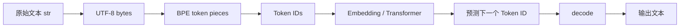
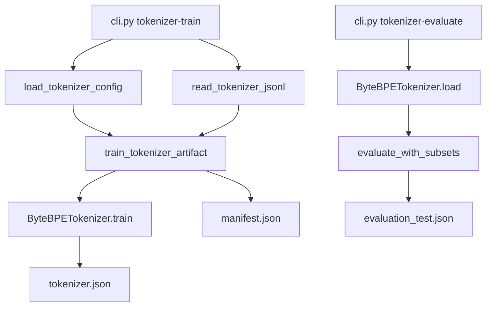

# Stage 1 零基础完整讲义：从文本到 Byte-level BPE Tokenizer

> 适用对象：第一次系统学习 Tokenizer、已经掌握 Python 基础的学习者  
> 唯一学习入口：`docs/lessons/stage01_learning_order.md`  
> 源码、配置、规格和阶段计划由学习导航在适当阶段引入，不需要现在打开  
> 学习约定：每道思考题后紧跟可折叠答案，不设置独立答案区

## 开始前：怎样使用这份讲义

如果这是你第一次学习 Tokenizer，请不要从头到尾一次读完，也不要同时打开标题上方列出的所有项目文件。先阅读唯一导航：`docs/lessons/stage01_learning_order.md`。导航会告诉你每次只读本讲义的哪些章节、随后看哪个测试和哪个 Python 函数。

标题中的 “Byte-level BPE Tokenizer” 暂时可以理解为：

> 一套把文本变成整数列表、又能从整数列表还原文本的规则；它先把文本变成字节，再把经常相邻出现的字节组合起来。

本讲义采用以下用词规则：

1. 专业词第一次出现时给出英文全称、中文名称和白话解释；
2. 第一轮只要求理解“第一层词汇”，其余词汇可以随用随查；
3. 英文全称用于帮助识别资料，不要求第一次学习就背下来；
4. 阶段计划、规格和实验报告是学完后的证据材料，不是入门前置阅读。

## 第一层词汇：现在必须知道

| 词汇 | 中文与英文 | 第一次学习时的白话理解 |
|---|---|---|
| Text | 文本 | 例如 `"你好"` 这样的 Python 字符串 |
| Tokenizer | 文本编码器/分词器 | 把文本转换为模型可处理的整数，也负责把整数还原成文本 |
| Token | 文本编码单元 | Tokenizer 切分后的一小段；可能是一个 byte，也可能是多个 byte 的组合 |
| Token ID | Token Identifier，Token 标识编号 | 每个 Token 对应的整数编号，模型实际接收的是它 |
| Vocabulary / Vocab | 词表 | “Token 与 ID 如何对应”的完整清单 |
| Encode | 编码 | 文本变成 Token ID 列表 |
| Decode | 解码 | Token ID 列表还原为文本 |
| Byte | 字节 | 计算机保存文本时使用的基础数值单位，取值为 0～255 |
| Unicode | 统一字符编码标准 | 给世界各地字符分配统一编号的规则 |
| UTF-8 | Unicode Transformation Format, 8-bit | 把 Unicode 字符编号保存成一个或多个 byte 的常用方法 |
| BPE | Byte Pair Encoding，字节对编码 | 反复把最常见的相邻两个单元合并成一个新 Token |
| Pair / Merge | 相邻对 / 合并 | pair 是相邻两个 Token；merge 是把它们替换为一个新 Token |

先记住一条主线即可：

```text
文本
→ UTF-8 把文本表示成 byte
→ 每个 byte 先有一个基础 Token ID
→ BPE 把常见的相邻 Token 合并
→ 得到更短的 Token ID 列表
```

## 第二层词汇：看到时再查，不要求现在背诵

| 缩写/词汇 | 英文全称 | 白话解释 |
|---|---|---|
| PAD | Padding Token | 为了让一批序列长度一致而补上的占位 Token |
| BOS | Beginning Of Sequence | 表示一段序列开始 |
| EOS | End Of Sequence | 表示一段序列结束 |
| UNK | Unknown Token | 表示无法识别内容；完整 byte 词表通常不会在正常编码中产生它 |
| OOV | Out Of Vocabulary | 输入内容不在词表中的问题 |
| LM | Language Model | 语言模型；根据已有 Token 预测后续 Token |
| Embedding | 嵌入层 | 把一个 Token ID 查表变成一组可训练数字 |
| LM Head | Language Model Head | 把模型内部结果变成“下一个 Token ID”的候选分数 |
| NFC/NFD | Unicode Normalization Form C/D | 两种 Unicode 规范化形式，用于处理视觉相似但内部表示不同的文本 |
| Round-trip | 往返一致性 | 文本编码再解码后是否与原文完全相同 |
| Baseline | 基线 | 用来比较的简单或公认方案 |
| Metric | 指标 | 用数字评价某种性质的计算规则 |
| Corpus | 语料 | 用于训练或评测的一组文本 |
| Artifact | 实验产物 | 模型、报告等一次运行保存下来的文件 |
| Manifest | 清单文件 | 记录输入来源、配置、哈希和输出的说明文件 |
| Schema | 数据结构规则 | 规定文件必须有哪些字段、字段是什么类型 |
| SHA-256 | Secure Hash Algorithm 256-bit | 为文件内容计算的长指纹；内容变化通常会导致指纹变化 |
| Deterministic | 确定性 | 相同输入和配置应得到相同结果 |
| Tie-break | 平局裁决规则 | 两个候选频率相同时，明确选哪一个 |
| CLI | Command-Line Interface | 在终端中输入的命令入口 |
| API | Application Programming Interface | 代码之间约定的调用方式 |
| JSONL | JSON Lines | 一行保存一条 JSON 记录的文本格式 |
| JSON | JavaScript Object Notation | 用键和值保存结构化信息的文本格式；名字来自 JavaScript，但 Python 也常用 |
| RNG / Seed | Random Number Generator / 随机种子 | RNG 产生伪随机数；seed 用来让使用随机数的过程尽量可重复 |
| NFKC | Normalization Form Compatibility Composition | 一种更强的 Unicode 兼容规范化，可能把外观/用途相近的字符统一起来 |
| `strip` | 去除首尾空白 | Python 字符串操作；可能删除开头和结尾的空格、换行等 |
| MB/s | Megabytes per second，每秒兆字节 | 表示吞吐速度；数值越大代表单位时间处理的 byte 越多 |
| Big-O / `O(MN)` | 渐近复杂度记号 | 粗略描述输入规模增长时计算量如何增长，不是实际运行秒数 |
| Rust / C++ | 编译型系统编程语言 | 常用于实现高性能底层库；本阶段不要求学习其语法 |
| G1-A / G1-B | Stage 1 的两个验收子门 | A 检查经典 BPE 正确性；B 检查现代方法实现与学习验收 |
| HF | Hugging Face | 提供 Tokenizer 和模型工具的开源生态；本项目把它作为成熟实现对照 |
| Python `str` | Python string | Python 中保存文本的对象类型 |
| Code point | 码点/字符编号 | Unicode 给一个抽象字符分配的数值编号，例如 `中` 是 `U+4E2D` |
| Hex / Decimal | Hexadecimal / Decimal，十六进制/十进制 | 表示同一个数的不同写法，例如十六进制 `E4` 等于十进制 `228` |
| Raw byte | 原始字节方案 | 不执行 BPE 合并，每个 UTF-8 byte 直接作为一个 Token |
| Frequency | 频率 | 某个 pair 在训练文本中出现的次数 |
| Rank | 合并顺序编号 | 第几个学到的 merge；编码必须按这个顺序重放 |
| Payload | 有效内容 | 一个 Token 实际代表的 byte 内容 |
| Fingerprint | 内容指纹 | 本项目中通常指根据模型规范内容计算的 SHA-256 |
| Checkpoint | 训练检查点 | 保存模型及训练状态、用于继续训练的文件集合；本阶段只需知道它依赖固定 Token ID |
| Fertility | Token 膨胀度指标 | 本项目中是 Token 数除以空白分段数，必须连同分母定义一起解释 |
| Throughput | 吞吐 | 单位时间处理多少数据，本项目用 bytes/s 观察编码速度 |
| Subset | 子集 | 从完整评测语料中按语言或类型划出的一组文本 |
| Strict | 严格模式 | 碰到非法输入立即报错，不用替换字符偷偷继续 |
| Fail-fast | 快速失败 | 在最早发现契约不满足时停止并报告清楚原因 |
| Reference implementation | 参考实现 | 用于比较行为的成熟实现，不代表本项目必须产生完全相同的 Token ID |
| Vocabulary budget | 词表预算 | 允许词表最多包含多少 Token |
| Exit code | 退出码 | 命令结束时返回的整数；通常 0 表示成功，非 0 表示失败 |

遇到第二层术语时，只需要回表查看当前一行，不要暂停主线去扩展学习整个相关领域。

## 0. 学完以后你应当能做什么

完成本讲义和代码实验后，你不应只会说“BPE 会合并高频 pair”，而应当能够：

1. 从 Unicode code point 写出 UTF-8 bytes，再写出基础 Token ID；
2. 手算一个两轮 BPE 训练过程；
3. 解释训练时选 pair 与编码时重放 merge rank 的区别；
4. 说明为什么 byte-level BPE 通常不会产生 OOV；
5. 解释 BOS/EOS/PAD/UNK 的职责和固定 ID 契约；
6. 编写并测试 train、encode、decode、save、load；
7. 定义 round-trip、bytes/token、chars/token、fertility 和 unknown rate；
8. 区分模型内容哈希、文件哈希与训练数据哈希；
9. 看懂 ForgeLLM 与 Hugging Face Tokenizers 对照报告；
10. 诚实地说明当前完成的是算法/工程候选，而不是正式自然语言语料验收。

## 1. Tokenizer 在语言模型链路中的位置

语言模型的矩阵运算不能直接接收 Python 字符串。Tokenizer 在文本世界和整数张量世界之间建立双向映射：



Tokenizer 会直接影响：

- 模型输入/输出词表大小，也就是 Embedding 与 LM Head 的参数量；
- 同一段文本占多少 Token，从而影响上下文长度、训练成本和推理成本；
- 不同语言、代码、数字和 Emoji 的切分公平性；
- 模型能否无损表达输入；
- 不同训练或评测结果能否正确比较。

Tokenizer 不是“训练前随便处理一下文本”。一旦模型开始训练，词表和 Token ID 就成为模型权重语义的一部分。更换 Tokenizer 但保留原 Embedding，相当于给同一行参数换了含义。

### 思考题 1

为什么不能训练到一半后直接把 Tokenizer 的词表换成另一个更好的词表，同时继续使用原模型权重？

<details>
<summary>参考答案</summary>

Embedding 第 `i` 行和 LM Head 第 `i` 个输出都绑定 Token ID `i` 的语义。更换词表后，ID `i` 可能从原来的 `the` 变成一段中文或另一个 byte 序列；原参数学到的语义就被错误地解释。除非设计并验证权重迁移方案，否则必须把 Tokenizer、模型配置和 checkpoint 一起冻结。

</details>

## 2. Unicode、code point、UTF-8 byte、Token 与 Token ID

这五个概念必须分开：

| 层级 | 示例 | 含义 |
|---|---|---|
| 字符显示 | `中` | 人看到的符号 |
| Unicode code point | `U+4E2D` | Unicode 给抽象字符分配的编号 |
| UTF-8 bytes | `E4 B8 AD` | 该 code point 的 UTF-8 存储形式 |
| Token bytes | 可能是 `E4`、`B8`、`AD`，也可能 merge 成 `E4B8AD` | Tokenizer 的符号单元 |
| Token ID | 例如 `232, 188, 177` 或一个 learned ID | 模型实际接收的整数 |

ForgeLLM 固定 `byte_id = byte_value + 4`，因为 ID `0..3` 留给特殊 Token。于是 `中` 的三个初始 byte ID 是：

```text
E4(hex) = 228(decimal) -> 232
B8(hex) = 184(decimal) -> 188
AD(hex) = 173(decimal) -> 177
```

如果训练学到这三个字节的合并，它可能最终只占一个 Token；如果没有学到，仍可用三个 byte Token 表示。因此 byte-level 路径先保证覆盖，再通过 BPE 学习压缩。

### 思考题 2

“一个中文字符固定等于三个 Token”是否正确？

<details>
<summary>参考答案</summary>

不正确。很多常见中文 code point 的 UTF-8 编码确实是三个字节，所以在未 merge 的 raw-byte 基线中常对应三个 Token。但 BPE 可以把其中的 byte pair 或完整三字节序列合并；最终 Token 数取决于训练语料、词表预算和 merge 顺序。少数字符的 UTF-8 长度也不一定是三个字节。

</details>

## 3. Unicode 规范化为什么不放在 Tokenizer 内部

视觉上相似的文本未必具有相同 code point 和 byte 序列。例如：

```text
预组形式：é       U+00E9          UTF-8 C3 A9
组合形式：é       U+0065 U+0301   UTF-8 65 CC 81
```

ForgeLLM 的 Tokenizer 不自动执行 NFC、NFKC 或 strip。原因是：

1. Tokenizer 的核心职责是可逆编码，不应隐藏修改正文；
2. 数据规范化策略必须在数据 Manifest 中明确记录；
3. 有些领域需要区分原始 code point，自动规范化可能破坏信息；
4. 把规范化放在训练前，可保证训练、验证和线上输入使用同一显式策略。

当前测试要求两种形式分别满足 round-trip，而不是强制它们编码相同。

### 思考题 3

如果产品决定统一使用 NFC，应该在哪里执行？需要记录什么？

<details>
<summary>参考答案</summary>

应在 Tokenizer 训练之前的数据处理层执行，并且线上输入走同一规范化路径。Manifest 至少记录规范化形式（NFC）、实现版本或代码版本、输入/输出哈希和统计。Tokenizer 仍对传入字符串做无损编码，这样“文本变换”和“Token 编码”是两个可以独立审计的步骤。

</details>

## 4. 为什么选择 byte-level BPE

几种基础方案各有取舍：

| 方案 | 优点 | 主要问题 |
|---|---|---|
| 词级 | 常见词很短、直观 | 词表巨大；新词/OOV；中英分词规则不同 |
| 字符/code point 级 | 比词级覆盖广 | Unicode 字符集合大；罕见字符仍困难 |
| byte 级 | 256 个 byte 覆盖任意合法 UTF-8 | 序列长，常见文本压缩差 |
| byte-level BPE | 保留 byte 覆盖，同时学习常见 byte 串 | 训练/实现更复杂；切分受语料偏差影响 |

Byte-level BPE 的关键结构是：

```text
256 个基础 byte Token
+ 4 个特殊 Token
+ 若干 learned merge Token
= 最终词表
```

本项目配置 `vocab_size=320`，因此最多学习 `320 - 260 = 60` 次 merge。真实大模型常使用数万到十几万词表，但这里刻意缩小，以便每次 merge 都能被检查和解释。

### 思考题 4

byte-level BPE 的 `<unk>` 为什么通常不会由普通编码产生，但项目仍保留它？

<details>
<summary>参考答案</summary>

任意合法 UTF-8 文本最终都是 `0..255` 的 byte 序列，而基础词表完整包含 256 个 byte，所以普通编码总有表示，unknown rate 应为 0。保留 `<unk>` 是为了固定与下游模型/参考库的接口、处理外部损坏数据或不完整兼容路径，但不能用它掩盖基础 byte 缺失。

</details>

## 5. BPE 训练到底在做什么

BPE 训练从 byte Token 序列开始，反复执行：

1. 统计文档内部相邻 pair；
2. 选择最高频 pair；
3. 为它创建一个新 Token；
4. 从左到右执行非重叠替换；
5. 达到词表预算或最高频低于阈值时停止。

ForgeLLM 不跨文档边界统计 pair。若一篇文档以 `a` 结尾，下一篇以 `b` 开头，不能凭文件排列制造 `(a,b)`。

### 手算样例：两篇 `abab`

基础 ID：`a=97+4=101`，`b=98+4=102`。

```text
文档 1: 101 102 101 102
文档 2: 101 102 101 102
```

第一轮 pair 频率：

| pair | 每篇次数 | 总次数 |
|---|---:|---:|
| `(101,102)`，即 `ab` | 2 | 4 |
| `(102,101)`，即 `ba` | 1 | 2 |

选择 `(101,102)`，建立 `260 -> b"ab"`。非重叠替换后：

```text
文档 1: 260 260
文档 2: 260 260
```

第二轮只有 `(260,260)`，频率为 2，建立 `261 -> b"abab"`。此时 `encode("abab") == [261]`。

对应测试位于 `tests/unit/test_bpe_tokenizer.py`，它明确断言两次 merge 的左右 ID、新 ID 和最终 bytes。

### 思考题 5

字符串 `aaaaa` 合并 pair `(a,a)` 时，为什么一次替换结果是 `[aa, aa, a]`，而不是产生四个互相重叠的 `aa`？

<details>
<summary>参考答案</summary>

Token 序列的每个位置在一次 merge 中只能参与一次替换。实现从左到右扫描，匹配后索引前进 2，因此位置 1–2、3–4 被替换，位置 5 保留。若允许重叠，一个原 Token 同时属于多个新 Token，编码序列不再是原序列的合法分割，也无法用简单拼接稳定解码。

</details>

## 6. 确定性 tie-break 是可复现性的核心

两个 pair 可能具有相同最高频率。如果实现依赖 `dict` 插入顺序、文档读取顺序或并行归并顺序，训练相同语料可能得到不同的第一步 merge；第一步差异又会改变后续全部序列。

ForgeLLM 的规则是：

```python
pair, frequency = min(counts.items(), key=lambda item: (-item[1], item[0]))
```

解释：

- `-frequency` 越小，原频率越大；
- 频率相同时，`(left_id, right_id)` 字典序越小越优先；
- `Counter` 的总频率与文档排列顺序无关；
- 测试会反转训练文档顺序并比较模型 fingerprint。

### 思考题 6

只固定 Python random seed，能否解决 pair 同频时的非确定性？

<details>
<summary>参考答案</summary>

不能保证。这里没有必要使用随机数；非确定性可能来自集合/映射遍历、输入顺序或并行规约，而不经过随机数生成器。正确做法是为同频情况定义总排序规则，并用输入顺序扰动测试证明结果相同。seed 只控制真正使用 RNG 的路径。

</details>

## 7. 训练与编码不是同一个算法

训练时，我们根据训练语料的当前序列重新统计频率并决定下一次 merge。训练结束后，模型保存一个有顺序的 merge 列表：

```text
rank 0: (left_0, right_0) -> 260
rank 1: (left_1, right_1) -> 261
...
```

编码新文本时不能重新统计它自己的最高频 pair。编码必须：

1. 转为基础 byte IDs；
2. 按 rank 0、rank 1……依次重放已经冻结的 merge；
3. 可选地添加 BOS/EOS。

否则，同一段文本会因同批次中出现了哪些其他文本而改变编码，模型接口就不稳定。

### 思考题 7

为什么编码一个只出现一次的 byte pair，也可能应用训练时因高频而学到的 merge？

<details>
<summary>参考答案</summary>

高频阈值只决定训练阶段是否把 pair 加入词表。一旦 merge 成为模型的一部分，编码阶段只检查该 pair 是否出现，不再要求它在当前文本中达到训练频率。因此已学习的 pair 在单个新文本中出现一次也会被合并。

</details>

## 8. ForgeLLM 的代码调用链



关键文件：

- `config.py`：只接受 `[tokenizer]`，严格拒绝缺失/未知字段、bool 冒充 int 和越界值；
- `corpus.py`：严格读取 JSONL、检查重复 ID 和可选内容哈希；
- `bpe.py`：训练、encode、decode、结构校验和 fingerprint；
- `evaluation.py`：raw-byte baseline、指标和 subset；
- `hf_reference.py`：可选成熟库适配；
- `workflow.py`：模型、Manifest、评测和对照 Artifact；
- `cli.py`：用户入口与统一错误码。

### 思考题 8

为什么 `workflow.py` 要求 `source_name` 与 `source_license`，即使训练夹具只是八篇小文本？

<details>
<summary>参考答案</summary>

算法是否正确和数据是否有权使用是两个独立问题。若训练入口允许省略来源，到了正式语料阶段很容易生成无法审计或无法发布的 Artifact。测试夹具也明确标记为 `forgellm-test-fixture / project-test-fixture`，从接口层养成相同证据纪律。

</details>

## 9. 特殊 Token 的契约

ForgeLLM v1 固定：

```text
<pad> = 0
<bos> = 1
<eos> = 2
<unk> = 3
byte 0x00..0xFF = 4..259
learned merges = 260..
```

职责：

- PAD：把不同长度序列补齐到 batch shape；是否参与 loss 由 attention mask / label mask 决定；
- BOS：表示序列开始，可为首个预测提供上下文；
- EOS：表示序列结束，生成时可作为停止条件；
- UNK：未知内容的占位接口；正常 byte-level 路径不应产生；
- 特殊 Token 不对应正文 bytes，默认 decode 时跳过。

固定 ID 的意义不在于“0 一定必须是 PAD”，而在于训练、模型配置、数据打包和推理全部遵循同一契约。

### 思考题 9

PAD 已经在 Tokenizer 中定义，为什么训练 loss 仍可能错误？

<details>
<summary>参考答案</summary>

定义 PAD ID 只说明哪个整数代表 padding。训练代码还必须构造 attention mask，并把不应监督的位置设置为 loss 的 ignore index。否则模型会把大量 PAD 当成真实目标学习。Tokenizer 契约是必要条件，不自动完成 batch 与 loss masking。

</details>

## 10. decode、UTF-8 完整性与失败边界

解码过程不是把 Token ID 当 code point，而是：

1. 找到每个普通 Token 保存的 byte payload；
2. 按 Token 顺序拼接 bytes；
3. 用 UTF-8 strict 解码整个 byte 串。

一个中文字符的第一个 byte 本身不是合法的完整 UTF-8 文本。因此 `decode([232])`（只包含 `中` 的 `E4` byte ID）应该失败，而不是用替换字符 `�` 悄悄继续。严格失败能暴露截断序列、损坏 Artifact 或错误采样逻辑。

### 思考题 10

为什么不能在每个 Token 上分别执行 `.decode("utf-8")` 再拼字符串？

<details>
<summary>参考答案</summary>

一个 Token 可能只包含某个多字节 code point 的一部分，而相邻 Token 合起来才是合法 UTF-8。逐 Token 解码会对合法的分割报错或产生替换字符。正确方法是先拼接所有 byte payload，再一次性 strict decode。

</details>

## 11. 保存、加载与三种哈希

模型 JSON 保存：

- schema version；
- 解析后的 config；
- 固定特殊 Token 映射；
- 每个普通 Token 的 bytes 十六进制；
- 有序 merge 列表；
- canonical model SHA-256。

加载器会检查：

- 顶层字段必须精确匹配；
- schema 与特殊 ID 必须符合 v1；
- 256 个基础 byte 的 ID 和 payload 完整；
- learned ID 连续；
- 每个 merge 只能引用此前存在的 Token；
- 新 Token bytes 等于左右 bytes 拼接；
- 重新计算的模型哈希一致。

需要区分：

| 哈希 | 证明什么 | 当前示例 |
|---|---|---|
| 输入文件 SHA-256 | 训练/评测文件的原始 bytes 相同 | train `dc74...11ed` |
| 模型内容 fingerprint | config、词表 bytes、merge 顺序相同 | `82cc...5223` |
| 模型 JSON 文件 SHA-256 | 包括缩进和自带 hash 字段的整个文件相同 | `e580...a003` |

模型 fingerprint 与文件哈希不同是正常的，因为 fingerprint 故意不把自身字段包含进自身计算。

### 思考题 11

两个模型 fingerprint 相同，能否单独证明它们使用了同一训练语料？

<details>
<summary>参考答案</summary>

不能。不同语料可能在给定词表预算下产生相同 merge 和词表。fingerprint 证明模型内容相同，不证明训练来源相同。训练 Manifest 还需要单独记录输入文件哈希、文档数、来源、许可证、预处理配置和代码版本。

</details>

## 12. 指标必须先定义分母

### 12.1 Round-trip rate

```text
完全满足 decode(encode(text)) == text 的文档数 / 总文档数
```

本阶段要求 100%。注意“肉眼看起来一样”不够，空格、换行和组合字符都必须精确相等。

### 12.2 Bytes/token

```text
评测文本 UTF-8 总字节数 / 编码后的普通 Token 总数
```

在同一文本上越大，通常说明 Token 序列越短。raw byte 固定为 1。它适合比较不同 Tokenizer，因为分子与 Tokenizer 无关。

### 12.3 Chars/token

```text
Python len(text) 的 Unicode code point 总数 / 普通 Token 总数
```

它直观，但 Unicode code point 不等于人类感知字符（grapheme cluster），跨语言解释要谨慎。

### 12.4 Fertility

本项目定义：

```text
普通 Token 总数 / Python str.split() 得到的非空白 segment 总数
```

分母必须写出来。对没有空格的中文句子，整句可能只算一个 segment，因此该 fertility 不等于中文“每词 Token 数”，只能作为当前显式口径。

### 12.5 Unknown rate

```text
UNK Token 数 / 普通 Token 总数
```

byte-level BPE 应为 0。空文本没有普通 Token 时，项目将 unknown rate 定义为 0，但 bytes/token 与 chars/token 为 `null`。

### 思考题 12

为什么不能只用“平均每个词多少 Token”比较中英文 Tokenizer，而不说明如何分词？

<details>
<summary>参考答案</summary>

“词”不是跨语言统一的可观察单位。英文可以粗略按空格分段，中文通常没有空格，代码与 Emoji 又有其他边界。若分母由另一个未说明的分词器产生，结果不可复现且可能偏向某种语言。必须冻结 segment 规则，或改用 bytes/token 等 Tokenizer 无关的分母。

</details>

## 13. 当前候选实验结果怎么读

训练夹具：8 篇项目原创文档；测试夹具：5 篇；词表预算 320；`min_pair_frequency=2`；编码重复 100 次计时。

| 实现 | 实际词表 | Test Tokens | bytes/token | chars/token | fertility | round-trip | unknown |
|---|---:|---:|---:|---:|---:|---:|---:|
| raw UTF-8 bytes | 256 | 182 | 1.0000 | 0.7637 | 9.5789 | 100% | 0% |
| ForgeLLM byte BPE | 320 | 152 | 1.1974 | 0.9145 | 8.0000 | 100% | 0% |
| HF ByteLevel+BPE 0.23.1 | 320 | 149 | 1.2215 | 0.9329 | 7.8421 | 100% | 0% |

ForgeLLM 相对 raw-byte 少 `30/182 ≈ 16.5%` Token；HF 参考少 `33/182 ≈ 18.1%` Token。HF 比 ForgeLLM 少 3 个 Token，但这不是“算法正确性高 3 个 Token”，因为两者的 byte 表示、trainer tie-break 和内部契约不完全相同。

同一次微型对照的粗略 encode 吞吐：raw `~106.6 MB/s`、ForgeLLM `~0.183 MB/s`、HF `~3.64 MB/s`。手写实现按每一个 merge 重扫序列，目标是清晰正确而不是性能。夹具只有 182 bytes，计时极易受启动与解释器噪声影响，因此这里只能说明成熟 Rust 路径明显更适合生产，不能作为严谨性能论文结论。

### 思考题 13

ForgeLLM 的 bytes/token 低于 HF，是否说明 ForgeLLM 的 BPE 实现错误？

<details>
<summary>参考答案</summary>

不能这样推断。两者都达到 100% round-trip、0% unknown，并遵循各自明确契约。HF ByteLevel 使用 byte-to-visible-symbol 表示和自己的训练 tie-break；ForgeLLM 直接用整数 byte ID、整个文档统计和明确的整数 pair tie-break。压缩差异可以来自契约和 merge 选择。要判定 ForgeLLM 错误，应检查其规格不变量、手算样例和确定性测试，而不是要求 Token ID 或最终 merge 与另一个实现完全相同。

</details>

## 14. 为什么手写实现慢，以及何时优化

当前 encode 对每个 merge 都扫描一次完整序列。若序列长度约为 `N`，merge 数为 `M`，最坏可近似看成 `O(MN)`。训练还会在每轮重新统计全部 pair 并重写全部序列。

这是有意的学习版本：

- 控制流直接对应 BPE 定义；
- 便于为每个 merge 写断言；
- 适合小语料与正确性基线；
- 可作为后续优化实现的 oracle。

成熟实现会用更高效的数据结构、增量频率更新、并行和 Rust/C++。优化顺序应是：

1. correctness 测试冻结；
2. profile 证明瓶颈；
3. 改数据结构或使用成熟库；
4. 对相同输入做编码与 round-trip 回归；
5. 再测稳定吞吐。

### 思考题 14

既然成熟库更快，为什么还要保留手写实现？

<details>
<summary>参考答案</summary>

手写实现承担三个角色：帮助理解算法、为规格提供可读参考、给成熟/优化实现提供 correctness oracle。正式大语料训练通常应使用成熟库，但如果只会调用库，就难以解释 tie-break、特殊 Token、round-trip 失败和指标差异。保留它不意味着生产路径必须使用它。

</details>

## 15. 测试矩阵与每类测试在证明什么

当前相关测试覆盖：

| 测试类型 | 示例 | 证明范围 |
|---|---|---|
| 手算单元测试 | `abab` 两轮 merge | pair frequency、ID、rank、payload |
| 正常 round-trip | 英文、中文 | 基本编码/解码 |
| Unicode 边界 | Emoji、NFC/NFD | UTF-8 byte 保真 |
| 空与空白 | 空串、tab、newline、首尾空格 | 不做隐藏清洗 |
| 特殊 Token | 固定 ID、BOS/EOS、decode skip | 接口契约 |
| 失败测试 | 越界 ID、partial UTF-8、损坏 hash | fail-fast |
| 确定性 | 反转训练文档顺序 | 模型 fingerprint 稳定 |
| 持久化 | save/load、拒绝覆盖 | Artifact 等价与安全 |
| 集成测试 | train→Manifest→evaluate | 模块连接正确 |
| Smoke | 子进程 CLI | 用户入口可用 |
| 参考对照 | HF 0.23.1 | 同口径成熟路径连通 |

测试全过不能证明正式语料质量或生产性能；它证明的是测试定义覆盖的行为。

### 思考题 15

为什么“模型文件能够被 JSON 解析”远远不够作为加载测试？

<details>
<summary>参考答案</summary>

JSON 语法正确不代表语义结构正确。文件可能缺少 byte、改变特殊 ID、让 merge 引用未来 Token、保存错误 payload 或被静默篡改。加载器必须验证 schema、ID 连续性、父子 payload 关系和 fingerprint，并验证加载后的 encode 与原模型一致。

</details>

## 16. G1-A 与 G1-B：从经典算法进入现代方法

### G1-A：算法与工程正确性

当前候选已具备：

- 手写确定性 byte-level BPE；
- train/save/load/encode/decode；
- 固定特殊 ID；
- raw-byte 与 HF 成熟实现对照；
- 指标、subset、CLI、Manifest；
- 当时的 68 项全仓测试、Ruff 和 mypy strict 通过；
- 项目夹具上的 100% round-trip、0% unknown 和压缩改善。

因此可以把 G1-A 判定为通过。

### G1-B：现代 Tokenizer 方法

项目目标在 2026-07-27 明确修正为掌握方法，而不是训练生产级 Tokenizer。因此 G1-B 使用小型夹具学习：

- pre-tokenization；
- BPE-dropout 与 Unigram sampling；
- 手写 Unigram EM/Viterbi；
- Picky BPE merge/remove；
- SuperBPE 两阶段 curriculum；
- 特殊 Token policy、byte offsets 与 entropy patching。

具体内容放在独立讲义 `docs/lessons/stage01_tokenizer_method_lab.md`。大型正式语料、词表规模优化和模型下游消融不再阻塞 Stage 1，但当前小型实验结果仍不能写成生产或模型质量结论。

### 思考题 16

为什么 G1-B 固定词表大小，而把时间用于比较算法？

<details>
<summary>参考答案</summary>

夹具只有少量人为文本，不代表未来预训练分布。在它上面搜索词表大小只会学习如何过拟合夹具，却不能回答 pre-tokenization、概率切分、词表删除或两阶段课程怎样工作。固定规模可以控制变量，把注意力放回算法。真正训练模型时再根据模型大小、语料和计算预算决定是否另做正式 Tokenizer 消融。

</details>

## 17. 建议你亲自完成的复现实验

### 17.1 运行质量门

```powershell
Set-Location D:\Users\27475\Desktop\Resume_Project\ForgeLLM
.\.venv\Scripts\python.exe scripts\dev.py check
```

### 17.2 训练候选

```powershell
.\.venv\Scripts\python.exe -m forgellm tokenizer-train `
  --config configs\tokenizer\bpe_v1.toml `
  --input tests\fixtures\tokenizer\train.jsonl `
  --output-dir artifacts\my_stage01_candidate\model `
  --source-name forgellm-test-fixture `
  --source-license project-test-fixture
```

输出目录必须不存在；这是为了防止静默覆盖旧实验。

### 17.3 独立评测

```powershell
.\.venv\Scripts\python.exe -m forgellm tokenizer-evaluate `
  --model artifacts\my_stage01_candidate\model\tokenizer.json `
  --input tests\fixtures\tokenizer\test.jsonl `
  --output artifacts\my_stage01_candidate\evaluation_test.json `
  --encode-repeats 100
```

### 17.4 成熟实现对照

先安装可选依赖：

```powershell
.\.venv\Scripts\python.exe -m pip install -r requirements-tokenizer.lock
```

再运行：

```powershell
.\.venv\Scripts\python.exe -m forgellm tokenizer-compare `
  --config configs\tokenizer\bpe_v1.toml `
  --model artifacts\my_stage01_candidate\model\tokenizer.json `
  --train-input tests\fixtures\tokenizer\train.jsonl `
  --evaluation-input tests\fixtures\tokenizer\test.jsonl `
  --output-dir artifacts\my_stage01_candidate\reference_comparison_test `
  --encode-repeats 100
```

## 18. 口述验收模板

请尝试在五分钟内不看讲义回答：

1. Tokenizer 为什么是模型的一部分？
2. `中` 如何从 code point 变成 byte ID？
3. BPE 一轮训练做什么？
4. 同频 pair 如何确定性选择？
5. 训练与 encode 的算法有何不同？
6. byte-level 为什么 unknown rate 应为 0？
7. round-trip、bytes/token 和 fertility 的分母是什么？
8. 当前三个基线的结果如何？
9. 手写实现为什么慢但仍有价值？
10. 为什么 G1-A 通过而完整 G1 仍未通过？

如果其中任何一题无法清楚回答，回到相应章节，先重新手算或运行最小测试，不需要额外学习无关工程知识。

## 19. 本阶段结论

我们已经把 Tokenizer 从“文本切成整数”的模糊概念落实为一组可验证契约：

```text
显式数据变换
→ 完整 byte 覆盖
→ 确定性 BPE merge
→ 固定特殊 Token ID
→ 可逆 encode/decode
→ 结构校验与模型哈希
→ 固定基线与分母
→ 参考库对照
→ 结论边界
```

下一项不是扩大词表或下载大型语料，而是进入 `docs/lessons/stage01_tokenizer_method_lab.md`：通过小型、可解释代码学习 pre-tokenization、Unigram、随机切分、Picky BPE、SuperBPE、特殊 Token policy 与 entropy patching。完成方法实验和口述验收后再进入 Stage 2。
