# Stage 1 新手学习导航：请只从这里开始

> 这是 Stage 1 的唯一学习入口。  
> 第一次学习时，不要先打开阶段计划、实验记录、规格文件，也不要从 `cli.py` 开始通读。  
> 完成一站的“通过标准”后，再进入下一站。

本页只先解释两个主题词：Tokenizer 是“文本与整数之间的转换规则”；BPE 是“反复合并最常见相邻单元的算法”。其他术语到主讲义再逐个学习。

## 1. 先理解三类文件

项目里出现很多文件，不代表它们都要同时学习。Stage 1 文件分为三类：

| 类型 | 用途 | 第一次学习时怎么处理 |
|---|---|---|
| 教学材料 | 从不知道到理解原理 | 按本文规定的顺序阅读 |
| 实现与测试 | 观察原理如何变成 Python | 只读指定符号或测试，不通读整个目录 |
| 规格与证据 | 约束工程行为、记录实验结论 | 学完原理和代码后再查阅 |

因此：

- `stage01_byte_level_bpe_tokenizer.md` 是 G1-A 经典 BPE 讲义；
- `stage01_tokenizer_method_lab.md` 是随后学习的 G1-B 现代方法讲义；
- `bpe.py` 和相关测试是学习用代码；
- `tokenizer_spec_v1.md`、阶段计划、实验记录是查证材料，不是入门教材。

## 2. 学习路线总图

```mermaid
flowchart LR
    A["第 0 站：读本导航"] --> B["第 1 站：文本如何变成数字"]
    B --> C["第 2 站：手算 BPE"]
    C --> D["第 3 站：先看测试期待什么"]
    D --> E["第 4 站：阅读核心 Python"]
    E --> F["第 5 站：保存、加载与命令"]
    F --> G["第 6 站：指标与成熟实现对照"]
    G --> H["第 7 站：亲自运行"]
    H --> I["第 8 站：核对 G1-A 证据"]
    I --> J["第 9 站：G1-B 方法实验讲义"]
    J --> K["第 10 站：Pre-tokenization 与随机切分"]
    K --> L["第 11 站：Unigram 动态规划"]
    L --> M["第 12 站：Picky 与 SuperBPE"]
    M --> N["第 13 站：控制 Token 与动态 Patch"]
    N --> O["第 14 站：运行方法实验并口述验收"]
```



不要跳过第 2 站的手算。能手算以后，代码中的 `pair`、`merge`、`new_id` 才不是抽象变量名。

## 3. 第 0 站：只读本导航

本阶段只要求以下前置知识：

- 知道 Python 字符串类似 `"hello"`；
- 知道列表类似 `[1, 2, 3]`；
- 能看懂函数有输入、返回值；
- 能运行一条 PowerShell 命令。

目前不要求你已经了解 Unicode、BPE、模型训练或 Hugging Face。

通过标准：你知道下一份文件只打开讲义，而不是同时打开全部“主要文件”。

## 4. 第 1 站：理解“文本如何变成数字”

### 阅读范围

打开 `docs/lessons/stage01_byte_level_bpe_tokenizer.md`，只阅读：

1. “开始前：怎样使用这份讲义”；
2. “第一层词汇：现在必须知道”；
3. 第 0～4 节。

暂时不要继续阅读第 5 节之后的内容，也不要打开 Python 源码。

### 本站只解决四个问题

1. Tokenizer 为什么存在？
2. 字符、Unicode 编号、UTF-8 字节、Token 和 Token ID 有什么区别？
3. 为什么从 byte 开始可以覆盖中文、英文和 Emoji？
4. 为什么还要把常见 byte 组合成更大的 Token？

### 通过标准

用自己的话解释下面这条链路：

```text
“中”
→ Unicode 中的字符编号
→ UTF-8 的三个字节 E4 B8 AD
→ 三个基础 Token ID
→ 如果学过相关合并，可能进一步变成更少的 Token
```

如果解释不出来，停在本站复习，不需要查看其他文件。

## 5. 第 2 站：手算 BPE

### 阅读范围

继续阅读主讲义第 5～7 节。

### 必做练习

拿纸手算两篇相同文本：

```text
abab
abab
```

完成：

1. 写出 `a`、`b` 的基础 Token ID；
2. 数出 `(a,b)` 和 `(b,a)` 出现多少次；
3. 写出第一次合并后的两个序列；
4. 写出第二次合并；
5. 解释为什么一次合并不能重叠使用同一个位置。

### 通过标准

不看答案也能得到：

```text
(101, 102) -> 260
(260, 260) -> 261
encode("abab") == [261]
```

并能解释“训练时选择新合并”和“编码时重放已有合并”不是同一件事。

## 6. 第 3 站：先看测试期待什么

代码学习先从小而明确的预期开始，不先跳进完整实现。

### 文件顺序

1. `tests/fixtures/tokenizer/train.jsonl`
2. `tests/unit/test_bpe_tokenizer.py`

### 第一次只读这些测试

按函数名寻找并阅读：

1. `test_manual_pair_counts_and_ranked_merges_are_explainable`
2. `test_training_is_independent_of_document_order`
3. `test_round_trip_preserves_exact_utf8_text`
4. `test_special_token_contract_is_fixed`
5. `test_save_load_preserves_model_and_refuses_overwrite`

你不需要记住 pytest 语法。只需把每个 `assert` 翻译成一句中文，例如：

```text
assert tokenizer.encode("abab") == [261]
```

翻译为：“对于已经训练好的这个 Tokenizer，`abab` 必须编码成一个 ID 261。”

通过标准：能说出上述五个测试分别防止什么错误。

## 7. 第 4 站：阅读核心 Python 实现

### 先读配置，再读算法

1. `src/forgellm/tokenization/config.py`
2. `src/forgellm/tokenization/bpe.py`

### `config.py` 只读这些内容

1. `BASE_VOCAB_SIZE`
2. `TokenizerConfig`
3. `TokenizerConfig.from_mapping`

目的：理解为什么基础词表是 `4 个特殊 Token + 256 个 byte = 260`，以及词表目标大小、最小合并频率如何进入训练。

### `bpe.py` 必须按以下符号顺序阅读

1. `PAD_ID`、`BOS_ID`、`EOS_ID`、`UNK_ID`、`BYTE_OFFSET`
2. `Merge`
3. `_replace_pair`
4. `ByteBPETokenizer.train`
5. `ByteBPETokenizer.encode`
6. `ByteBPETokenizer.decode`

第一次阅读到这里就停。不要立即阅读 `_payload`、`load` 和 `_validate_structure`。

### 阅读一个函数的固定方法

每个函数只回答五件事：

1. 输入是什么？
2. 输出是什么？
3. 循环中的数据当前长什么样？
4. 哪个条件会停止或报错？
5. 哪个测试验证它？

通过标准：你能从 `train()` 的文本输入一路追踪到 `Merge(left_id, right_id, new_id)`，并能从 `encode()` 的字符串一路追踪到整数列表。

## 8. 第 5 站：保存、加载与命令入口

### 先读主讲义

阅读主讲义第 8～11 节。

### 再读文件

严格按以下顺序：

1. 回到 `bpe.py`，阅读 `_payload`、`fingerprint`、`save`、`load`、`_validate_structure`；
2. `src/forgellm/tokenization/corpus.py`；
3. `src/forgellm/tokenization/workflow.py` 中的 `train_tokenizer_artifact`；
4. `src/forgellm/cli.py` 中搜索字符串 `tokenizer-train`，只追踪该分支。

### 调用链

```text
PowerShell 命令
→ cli.py 读取参数
→ load_tokenizer_config 读取配置
→ read_tokenizer_jsonl 读取训练文本
→ train_tokenizer_artifact 组织流程
→ ByteBPETokenizer.train 执行算法
→ tokenizer.json 保存模型
→ manifest.json 保存来源、配置和哈希
```

通过标准：能说出 `tokenizer.json` 与 `manifest.json` 分别保存什么，以及为什么两个文件都需要。

## 9. 第 6 站：学习指标与成熟实现对照

### 阅读顺序

1. 主讲义第 12～16 节；
2. `src/forgellm/tokenization/evaluation.py`；
3. `tests/unit/test_tokenizer_evaluation.py`；
4. 最后才读 `src/forgellm/tokenization/hf_reference.py`。

Hugging Face 参考实现不是学习 BPE 原理的前置条件。它只回答：“成熟库在相同文本和相近配置下表现如何？”

### 本站必须理解的三个指标

- round-trip rate：编码再解码后，原文完全不变的文档比例；
- bytes/token：原文 UTF-8 字节数除以 Token 数；
- unknown rate：`<unk>` 数除以普通 Token 数。

`fertility`、`throughput` 和子集报告先达到“能查表解释”的程度，不要求第一次就背诵。

通过标准：能解释为什么 round-trip 必须为 100%、byte-level unknown rate 应为 0，以及为什么不能只凭 bytes/token 判断实现是否正确。

## 10. 第 7 站：亲自运行

阅读主讲义第 17 节，按顺序执行：

1. 完整质量检查；
2. `tokenizer-train`；
3. `tokenizer-evaluate`；
4. 安装可选依赖后再运行 `tokenizer-compare`。

每条命令运行后只检查这些稳定事实：

- 退出码是否为 0；
- 模型和报告文件是否存在；
- round-trip 是否为 1.0；
- unknown rate 是否为 0.0；
- ForgeLLM BPE 的 Token 数是否少于 raw byte。

微型测试的每秒吞吐会波动，不需要复现完全相同的小数。

通过标准：能够独立完成一次新输出目录的训练和评测，并指出实验能证明什么、不能证明什么。

## 11. 第 8 站：最后阅读规格与证据

只有完成前七站以后，才按以下顺序阅读：

1. `docs/tokenizer/tokenizer_spec_v1.md`：核对实现必须遵守的规则；
2. `docs/experiments/2026-07-25_stage01_tokenizer_candidate.md`：核对实际命令和结果；
3. `docs/stages/learning_stage_01_tokenizer.md`：核对 G1-A/G1-B 门禁；
4. `HANDOFF_SUMMARY.md`：只在交接项目时阅读，不作为课程正文。

通过标准：能解释“代码测试通过”“候选实验完成”和“完整 G1 通过”为什么是三种不同结论。

## 12. 第 9 站：进入 G1-B 方法实验

先完整阅读 `docs/lessons/stage01_tokenizer_method_lab.md` 的第 0～2 节。本阶段不再下载正式语料，也不搜索词表规模。

通过标准：能解释“产品级 Tokenizer 训练”与“Tokenizer 方法学习”的区别，以及 pre-tokenization 改变的是哪些 pair 可以被统计和 merge。

## 13. 第 10 站：Pre-tokenization 与随机切分

严格按顺序阅读：

1. `src/forgellm/tokenization/pretokenization.py`；
2. `tests/unit/test_pretokenization.py`；
3. `src/forgellm/tokenization/advanced_bpe.py` 中 `_replace_pair`、`train_classic_bpe`、`EducationalBPE.encode`；
4. `tests/unit/test_advanced_bpe.py` 中 classic、boundary 和 dropout 测试；
5. G1-B 讲义第 3 节。

通过标准：能用一个含空格的例子解释边界怎样改变 pair count，并能解释 dropout 为什么产生不同 Token 序列却不改变 decode。

## 14. 第 11 站：Unigram 动态规划

先读 G1-B 讲义第 4 节，再读 `src/forgellm/tokenization/unigram.py`：

1. `_candidate_counts`；
2. `EducationalUnigram._edges`；
3. `EducationalUnigram.encode`；
4. `_expected_counts`；
5. `train_unigram`；
6. `sample_encode`；
7. `tests/unit/test_unigram_tokenizer.py`。

通过标准：能区分 forward-backward、EM、Viterbi 和 sampling 的职责，能说明 256 个 byte fallback 为什么保证未见文本可编码。

## 15. 第 12 站：Picky BPE 与 SuperBPE

先读讲义第 5～6 节，再回到 `advanced_bpe.py`：

1. `BPEEvent`；
2. `_expand_token`；
3. `train_picky_bpe`；
4. `train_super_bpe`；
5. `EducationalBPE.encode` 中 phase 1/2 和 REMOVE 分支；
6. `test_picky_bpe_replaces_underused_tokens_and_preserves_round_trip`；
7. `test_super_bpe_curriculum_learns_cross_space_expression`。

通过标准：能沿事件顺序解释一个 Token 被创建、参与更长 merge、被 remove 后，为什么最终编码仍可逆；能解释 SuperBPE 与从一开始 `none` 的区别。

## 16. 第 13 站：特殊 Token、Offset 与动态 Patch

按顺序阅读：

1. G1-B 讲义第 7 节；
2. `src/forgellm/tokenization/special_tokens.py`；
3. `tests/unit/test_special_token_policy.py`；
4. `src/forgellm/tokenization/entropy_patching.py`；
5. `tests/unit/test_entropy_patching.py`。

通过标准：能解释用户字面量 `<eos>` 与控制 ID 的区别、byte offset 与字符下标的区别，以及 entropy patch 为什么不是固定词表 Token。

## 17. 第 14 站：统一实验与最终验收

先读 `src/forgellm/tokenization/method_lab.py`，再运行：

```powershell
.\.venv\Scripts\python.exe scripts\tokenizer_method_lab.py `
  --train tests\fixtures\tokenizer\train.jsonl `
  --evaluation tests\fixtures\tokenizer\method_lab_evaluation.jsonl `
  --output artifacts\stage01_tokenizer_method_lab\my_report.json
```

最后阅读：

1. `docs/experiments/2026-07-27_stage01_g1b_method_lab.md`；
2. G1-B 讲义第 8～11 节；
3. `docs/stages/g1b_tokenizer_method_lab_plan.md` 的学习者验收清单。

通过标准：独立回答 G1-B 讲义的 12 道口述题，并能指出当前实验可以证明和不能证明的结论。

## 18. 完整文件学习顺序

| 顺序 | 文件 | 阅读方式 |
|---:|---|---|
| 1 | `docs/lessons/stage01_learning_order.md` | 全文 |
| 2 | `docs/lessons/stage01_byte_level_bpe_tokenizer.md` | 按各站指定章节分段阅读 |
| 3 | `tests/fixtures/tokenizer/train.jsonl` | 观察训练文本长什么样 |
| 4 | `tests/unit/test_bpe_tokenizer.py` | 先读五个指定测试 |
| 5 | `src/forgellm/tokenization/config.py` | 只读配置对象和验证 |
| 6 | `src/forgellm/tokenization/bpe.py` | 按指定符号分两次阅读 |
| 7 | `src/forgellm/tokenization/corpus.py` | 理解输入文件如何变成文档列表 |
| 8 | `src/forgellm/tokenization/workflow.py` | 先读训练，再读评测 |
| 9 | `src/forgellm/cli.py` | 只搜索三个 tokenizer 命令分支 |
| 10 | `src/forgellm/tokenization/evaluation.py` | 对照指标公式阅读 |
| 11 | `tests/unit/test_tokenizer_evaluation.py` | 用断言确认指标口径 |
| 12 | `src/forgellm/tokenization/hf_reference.py` | 只作为成熟实现对照 |
| 13 | `docs/tokenizer/tokenizer_spec_v1.md` | 最后核对契约 |
| 14 | `docs/experiments/2026-07-25_stage01_tokenizer_candidate.md` | 最后核对证据 |
| 15 | `docs/stages/learning_stage_01_tokenizer.md` | 最后核对门禁 |
| 16 | `docs/lessons/stage01_tokenizer_method_lab.md` | 按第 9～14 站分段阅读 |
| 17 | `src/forgellm/tokenization/pretokenization.py` | 先读边界策略 |
| 18 | `src/forgellm/tokenization/advanced_bpe.py` | 分三次读 classic、Picky、Super |
| 19 | `src/forgellm/tokenization/unigram.py` | 按动态规划顺序阅读 |
| 20 | `src/forgellm/tokenization/special_tokens.py` | 阅读显式控制策略与 offset |
| 21 | `src/forgellm/tokenization/entropy_patching.py` | 阅读动态 patch 玩具实现 |
| 22 | `src/forgellm/tokenization/method_lab.py` | 最后阅读统一编排 |
| 23 | `docs/experiments/2026-07-27_stage01_g1b_method_lab.md` | 最后核对实验证据 |

## 19. 卡住时的处理规则

- 遇到陌生缩写：先查主讲义的“第二层词汇表”，不要跳到搜索引擎扩展学习；
- 看不懂一行 Python：先写出变量在该行之前的具体示例值；
- 看不懂函数：回到“输入、输出、循环数据、停止条件、对应测试”五问；
- 手算不会：退回第 2 站，不继续读实现；
- 命令失败：保存完整错误，按主讲义的排查顺序处理；
- 一次学习不要同时打开超过三个文件。

## 20. 现在唯一需要做的下一步

如果 G1-A 已学完，现在打开 `docs/lessons/stage01_tokenizer_method_lab.md`，只阅读第 0～2 节；先完成 pre-tokenization，不要直接跳到 Picky BPE 或 SuperBPE。
