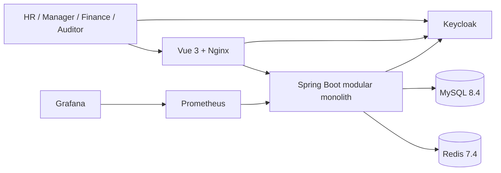

# 架构说明

## 架构决策

系统采用 **模块化单体**，而非初始即拆分微服务。组织、人事、排班、薪资、招聘、培训、通知和审计均为独立业务模块，但部署为一个 Spring Boot 应用。这样可以在保证事务一致性的同时，以 Spring Modulith 验证模块依赖；将来可依据真实负载和团队边界拆分。

## 系统上下文



## 模块关系

```text
organization ─┐
              ├─ workforce ── scheduling ── payroll
identity ─────┤          │          │
audit ◀───────┴──────────┴──────────┴── recruitment / training / notification
```

- `organization` 只负责科室及岗位主数据。
- `workforce` 负责员工生命周期，并提供员工状态和排班锁。
- `scheduling` 通过 `workforce` 公开服务锁定员工行，检查重叠班次后创建分配。
- `payroll` 读取员工基础薪资与已发布夜班数，生成工资单快照；不会重算已存在工资单。
- `audit` 是跨领域写入服务，记录谁在何时修改了什么。

## 并发排班策略

1. 创建班次前在同一事务中对员工行执行 `PESSIMISTIC_WRITE` 锁。
2. 查询该员工所有与新班次重叠的有效班次。
3. 数据库在 `(employee_id, start_time)` 上保存唯一索引，作为额外兜底。
4. 使用 `Idempotency-Key` 保存首次请求结果，重复提交直接返回原班次。
5. 对排班记录采用 `@Version`，以检测发布或修改时的更新丢失。

这不是依赖“先查询再插入”的脆弱实现：员工行锁将同一员工的排班写入串行化，事务和约束共同保护数据。

## 部署形态

Docker Compose 运行 MySQL、Redis、Keycloak、Spring Boot、Prometheus、Grafana，以及由
Nginx 托管的 Vue 生产构建产物。生产环境应将数据库、密钥和监控服务替换为受管服务，
通过密钥管理系统注入配置，并将 Keycloak 从 `start-dev` 切换为受支持的生产模式。
