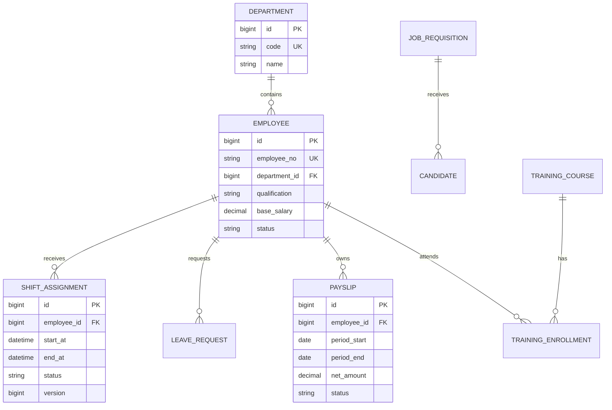

# 领域与 API

## 关键实体

| 模块 | 实体 | 说明 |
| --- | --- | --- |
| organization | Department | 医院科室，代码唯一 |
| workforce | Employee | 员工、岗位、资质、状态与基础工资 |
| scheduling | ShiftAssignment | 某员工在时间区间内的排班，带乐观锁版本 |
| scheduling | LeaveRequest | 请假申请和审批结果 |
| payroll | Payslip | 某员工某薪资周期的金额快照与审批状态 |
| recruitment | JobRequisition / Candidate | 招聘职位与候选人流程 |
| training | TrainingCourse / Enrollment | 培训课程与报名记录 |
| audit | AuditLog | 所有关键写操作的不可变审计记录 |

## 核心 ER 图



完整字段与约束的权威来源是 `src/main/resources/db/migration/V1__initial_schema.sql`；本图只展示
面试和架构沟通所需的核心关系。

## 主要 API

| 方法 | 路径 | 角色 | 用途 |
| --- | --- | --- | --- |
| POST | `/api/departments` | HR_ADMIN | 创建科室 |
| POST | `/api/employees` | HR_ADMIN | 创建员工 |
| GET | `/api/employees` | HR_ADMIN, DEPARTMENT_MANAGER | 分页查询员工 |
| POST | `/api/shifts` | HR_ADMIN, DEPARTMENT_MANAGER | 创建排班，支持 `Idempotency-Key` |
| POST | `/api/shifts/{id}/publish` | DEPARTMENT_MANAGER | 发布草稿班次 |
| POST | `/api/payslips/generate` | HR_ADMIN, FINANCE | 生成工资单草稿 |
| POST | `/api/payslips/{id}/submit` | HR_ADMIN | 提交工资单 |
| POST | `/api/payslips/{id}/approve` | FINANCE | 审批工资单 |
| POST | `/api/job-requisitions` | HR_ADMIN | 创建招聘需求 |
| POST | `/api/training-courses` | HR_ADMIN | 创建培训课程 |
| GET | `/api/audit-logs` | AUDITOR | 查询审计日志 |

## 错误格式

```json
{
  "timestamp": "2026-08-11T12:00:00Z",
  "status": 409,
  "code": "SHIFT_CONFLICT",
  "message": "Employee already has an overlapping shift",
  "traceId": "..."
}
```
