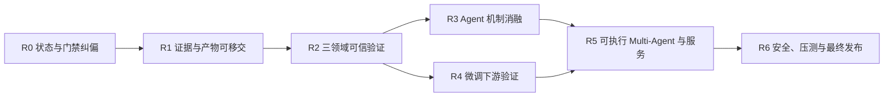

# RepoPilot（AGENT 项目）完成度审查与修正执行计划

> 审查日期：2026-08-09
>
> 审查对象：`RepoPilot` 当前 `main` 分支（HEAD：`c3c932f`）
>
> 文档用途：作为后续工作人员接手、修正、复验和最终交付的统一入口
>
> 状态口径：本文件覆盖 `docs/experiments/2026-08-09_project_review.md` 中“P7–P12 全部完成、三道门禁全绿、项目可交付”的结论；旧文件保留为历史记录，不应再作为当前完成状态依据。

> 2026-08-11 状态附注：本文件保留原始差距分析和最终 Definition of Done；实时指标
> 以 `docs/STATUS.md` 为准。质量门、证据索引、DABench 三次重复、FRAMES 60 题、
> SWE 5 题干净 holdout 和 1.5B Adapter 下游负结果已经完成。原路线中的可执行
> 最小可执行 Multi-Agent 已于 2026-08-11 接入并通过真实任务、恢复、取消和超时测试；
> 动态路由、服务 API、并发/故障注入、安全补强和 release/tag 仍未完成。注意：本文件的
> R5/R6 阶段名与后续证据 run 的 “R5 SWE / R6 FRAMES” 命名不同，不应混用。

## 1. 审查结论

RepoPilot 已经形成了一个可运行、可测试的教学型 Agent Runtime 与三领域评测骨架，但尚未达到原计划定义的“最终完成/可发布”状态。

当前最准确的描述是：

- **核心 Runtime MVP：基本完成**。任务契约、Agent Loop、结构化工具、Verifier、Checkpoint、Policy、Docker fail-closed、检索、Memory/Skills、教学型 MCP、Benchmark Adapter 等均有代码和自动测试。
- **实验研究闭环：部分完成**。DABench 有 35 题单次验证结果；FRAMES 仍是 10 题开发实验；SWE-bench-Live 为污染后的 0/3 dev smoke。
- **训练链路：PoC 完成，效果验证未完成**。SFT/DPO adapter 确实存在，但没有 base/SFT/DPO 下游对比，不能声称模型能力提升。
- **Multi-Agent：接口骨架完成，运行系统未完成**。当前实现能表达状态图和消息 envelope，但没有真正调度模型、工具、路由、重试、服务和并发压测。
- **工程发布：未完成**。统一质量入口当前失败，核心文档互相矛盾，关键实验产物只在本地忽略目录中，没有完整可移交证据索引，也没有 release/tag。

因此：**可以交接继续开发，但不得宣称项目已经最终完成。**

## 2. 审查依据与现场复验

本次审查没有直接采信已有总结，而是交叉检查了代码、测试、Git、实验文档、manifest 和本地产物。

### 2.1 已验证事实

| 项目 | 现场结果 | 判定 |
|---|---:|---|
| Git 提交数 | 29 | 有持续阶段记录 |
| 自动测试 | `70 passed` | 测试集当前通过 |
| Ruff lint | `All checks passed` | 语法/规则 lint 通过 |
| Ruff format | 28 个受版本控制文件需要格式化 | 统一 `check` 失败 |
| mypy（仅 `src`） | 64 files, 0 errors | 核心包通过 |
| mypy（配置声明范围 `src tests scripts`） | 未通过 | 完整类型门禁未闭环 |
| DABench | 25/35 = 71.4%，每配置仅 1 次 | 可作带限制的 validation 结果，不是 final 结果 |
| FRAMES | R2 三次为 20%/30%/10%，均值 20% | 仅 10 题开发信号，方差过大，不可外推 |
| SWE-bench-Live | 0/3，且任务已被开发污染 | 不可作为能力指标 |
| P10 | SFT/DPO adapter 与日志存在 | 只证明训练链路跑通 |
| P11 | 状态图、消息结构、4 个单测 | 只证明骨架存在 |

### 2.2 当前工作树保护要求

审查时工作树中存在以下非本审查改动：

- `.workbuddy/memory/2026-08-08.md`：modified
- `.workbuddy/memory/MEMORY.md`：modified
- `.workbuddy/memory/2026-08-09.md`：untracked
- `dpo_run.log`：untracked

后续人员不得擅自清理、覆盖或提交这些文件。先确认所有者和用途，再决定保留、忽略或单独归档。禁止批量删除文件或目录。

## 3. 按原 P7–P12 计划重新判定

以下百分比只用于排期，是对“原计划验收项”的粗粒度估计，不是产品 KPI。

| 阶段 | 当前状态 | 估计完成度 | 已有证据 | 未满足的原验收项 |
|---|---|---:|---|---|
| P7 接手冻结 | 部分完成 | 65% | `.venv`、70 tests、ADR、阶段提交 | `dev.py check` 不通过；README/上下文/Agent Card/安全文档仍陈旧；完整 mypy 范围未闭环 |
| P8A FRAMES | 部分完成 | 50% | R1/R2/R3/R4/A2，R2 三次重复 | 未做 R5、G1；未独立报告 Recall@k/MRR/nDCG；未冻结 50 题 validation；报告仍混有 25% 旧口径 |
| P8B SWE 可靠性 | 部分完成 | 45% | 结构化反馈、Patch Review 等实现；真实 evaluator 链路跑通 | 仍是污染集 0/3；未冻结全新 holdout；没有 1/3 resolved；artifact 记录不全 |
| P8C DABench | 较多完成 | 70% | 35 题 manifest、单题容错、base/D1/D2、失败审计 | 没有对关键配置各跑 3 次；未验证 feedback 相对 no-feedback 的稳定收益；样本只覆盖 11/52 表 |
| P9 机制消融 | 未完成 | 15% | 只完成 A2 无检索 | A3、A6、并行、Skills、MCP、Reviewer 触发策略均未完成 |
| P10 微调 | PoC 完成 | 45% | 9 条 SFT、8 对 DPO、adapter 和训练日志 | 无独立 holdout；无 base/SFT/DPO 下游评测；无三领域回归；DPO reference 为简化实现 |
| P11 Multi-Agent | 骨架完成 | 25% | 状态图、消息 envelope、trace 摘要、4 个单测 | 未接 AgentRuntime；无可执行编排；无路由/降级；无 API、取消、并发、压测、故障注入 |
| P12 最终评测/发布 | 未完成 | 30% | 协议文档、DABench 35 题、总结草稿 | FRAMES/SWE validation 未完成；无 final 级评测；统计、成本、延迟不完整；卡片陈旧；无 release/tag |

综合判断：

- 按“核心代码组件是否存在”评估，约为 **70%–80%**。
- 按“P7–P12 原验收项与证据链是否闭环”评估，约为 **40%–50%**。
- 按“可发布、可复现、可用于强简历/论文结论”评估，当前仍低于 **50%**。

## 4. 主要问题与修正意见

### P0：阻断发布的问题

#### P0-1 统一质量门禁并非全绿

`python scripts/dev.py check` 会先执行 Ruff format check；当前有 28 个受版本控制文件不符合格式，因此命令失败。`pyproject.toml` 声明 mypy 覆盖 `src/tests/scripts`，但已有总结只验证了 `mypy src`。

修正原则：

1. 先将纯格式化改动做成独立提交，不与功能修复混合。
2. 保持项目自有代码严格类型检查；第三方无类型包只能做模块级 override，不得对整个脚本目录 `ignore_errors`。
3. CI、本机和 README 只保留同一个权威命令：`python scripts/dev.py check`。
4. 必须在干净克隆、Python 3.11 和 3.12 两个 CI 版本上通过。

#### P0-2 文档状态互相冲突

当前至少有以下冲突：

- README、`project_context_summary.md` 和旧交接文档仍写“没有进行 SFT/LoRA/DPO”。
- Agent Card 仍写“未完成本地 Qwen 正式运行”。
- Security Threat Model 仍写“Docker daemon 未实际运行”。
- P8A/P9/P12 文档仍使用 R2=25%，权威三次均值应为 20.0%。
- 旧项目总结同时存在 P10/P11/P12 未完成和全部完成两套口径。

修正原则：建立一份 `docs/STATUS.md` 作为唯一当前状态源；历史实验记录不覆写，但在顶部加“已被何文件更新/取代”的说明。

#### P0-3 关键证据只存在于本机忽略目录

`artifacts/*` 被 Git 忽略。DABench 结果、FRAMES runs、P10 adapter 和训练日志虽然本机存在，但接手者从仓库无法获得完整证据。

修正原则：大文件继续不入 Git，但必须提交轻量级证据索引，至少包含：

- artifact ID、相对路径/外部 URI、文件大小、SHA-256；
- 生成命令、Git commit、模型与数据 revision、镜像 digest；
- 主指标与逐题结果摘要；
- 产物是否可公开、如何获取、如何复验。

#### P0-4 “最终完成”结论超出证据

70 个自动测试主要证明框架逻辑；它们不能替代真实模型、真实 Docker、未污染 benchmark、并发和安全攻击测试。DABench 71.4% 是单次 35 题 validation，FRAMES 与 SWE 均没有可引用的正式结果。

修正原则：将当前发布口径改为“research/teaching preview”，直到第 10 节的最终 Definition of Done 全部通过。

### P1：核心能力缺口

#### P1-1 软件工程主场景没有成功样本

RepoPilot 的核心定位包含代码 Agent，但 SWE-bench-Live 仍为 0/3，且三题已经污染。当前最多只能证明“官方评测链路能够运行”，不能证明“能够解决真实代码任务”。

修正意见：优先冻结全新 holdout，先过 1/3，再扩 10 题。禁止继续在旧三题上调参后宣称提升。

#### P1-2 Multi-Agent 只是数据结构，不是运行系统

`MultiAgentHarness` 当前只保存消息、状态图和 drift flag，没有调用 Provider、Tool、Verifier 或 Checkpoint，也没有真正沿图执行。

修正意见：先完成“单任务、单写者、可恢复”的最小可执行编排，再增加并发、服务和路由。不要先做 UI。

#### P1-3 微调没有回答原研究问题

P10 的原目标是判断微调是否改善 Agent/FRAMES 能力。目前只证明 9/8 个极小样本可以让训练 loss 和 preference margin 改善，极可能是过拟合。

修正意见：先把 HF/PEFT adapter 接入同一评测接口，然后在未参与训练和提示调优的冻结 holdout 上做 base、SFT、DPO 成对比较。

### P2：可信度与完整性缺口

- DABench 每个关键配置只跑 1 次，28.6% 的逐题翻转率说明结论不稳定。
- FRAMES 使用 oracle documents，A2 与 R2 持平说明当前瓶颈可能在证据合成，不足以证明检索改进。
- Evaluation 代码只有平均值，没有 bootstrap CI、McNemar、median、P95/P99。
- 安全自动测试只有 4 个，未覆盖符号链接逃逸、Prompt Injection、恶意依赖、fork bomb、磁盘/日志耗尽、Secret 诱导。
- 训练依赖没有独立锁文件；`requirements-dev.lock` 不能重建 P10 环境。
- 顶层 `api/`、`frontend/`、`executor/` 等多个目录只有占位文件，容易造成“生产层已存在”的误解。
- 没有 coverage 门槛、发布标签和从干净环境复现的证据。

## 5. 修正路线总览



不得跳过 R0/R1 直接扩大实验。R3 和 R4 可在 R2 的数据、指标与 holdout 冻结后并行。

## 6. 具体执行步骤

### R0：恢复可信基线（1–2 天，最高优先级）

目标：让代码、CI、文档和工作树状态一致。

执行：

1. 运行 `git status --short`，登记并保护现有 `.workbuddy` 改动和 `dpo_run.log`。
2. 单独提交 Ruff format 结果；不得混入逻辑修改。
3. 修复完整 mypy 范围：
   - 为项目函数补齐真实类型；
   - 对 `datasets`、`pyarrow` 等无类型第三方库做最小模块级配置；
   - 为训练脚本建立独立可安装的锁文件；
   - 不允许用全局 `ignore_errors` 掩盖项目代码问题。
4. 从干净环境执行权威门禁：

```powershell
python -m venv .venv
.\.venv\Scripts\python.exe -m pip install -r requirements-dev.lock
.\.venv\Scripts\python.exe -m pip install -e .
.\.venv\Scripts\python.exe scripts\dev.py check
```

5. 新建/更新 `docs/STATUS.md`，同步 README、Project Context、Agent Card、Security Threat Model、简历描述。
6. 将所有“R2=25%”改为“3 次均值 20.0%（20/30/10）”；单次 30% 可以保留，但必须明确 run-id。
7. 标记旧的 8 月 8 日/9 日总结为历史快照，链接到本文件和 `docs/STATUS.md`。

退出条件：

- `python scripts/dev.py check` 在本机与 Python 3.11/3.12 CI 全绿；
- README、状态页、卡片和最终总结不再互相冲突；
- Git 状态中所有改动的所有者与处理方式明确。

### R1：建立可移交证据链（1–2 天）

目标：让另一台机器能够知道“结果来自哪里、怎样复现、产物是否完整”。

执行：

1. 新建 `docs/evidence/artifact_index.json` 或等价 YAML。
2. 为每个权威 run 登记 command、commit、manifest hash、model digest、image digest、seed、结果路径和 SHA-256。
3. 新增只读校验脚本 `scripts/verify_artifact_index.py`，只校验存在性、大小和哈希，不重跑模型。
4. 小型 `summary.json`、逐题结果摘要和失败分类可以提交；adapter、大 trace、镜像和语料放外部存储并登记 URI。
5. 为 P10 单独冻结训练环境锁文件、训练数据 manifest、adapter hash 和数据污染审计。
6. 明确 artifact 保留策略：权威、失败、临时三类；不得覆盖旧实验结论。

退出条件：新接手者只用仓库和已登记存储位置即可定位全部权威结果；任一简历数字都能追到单个 run。

### R2：补齐三领域可信验证（5–10 天 + 运行时间）

#### R2-A DABench

1. 冻结 `base/no-feedback/feedback/D2` 的定义，确保每次只改变一个主变量。
2. 在相同 35 题上每个关键配置至少重复 3 次。
3. 同时报告 accuracy、有效输出率、执行成功率、重试率、平均/中位/P95 时间与 token。
4. 计算任务级 paired diff、bootstrap 95% CI；比较二元正确性时使用 McNemar。
5. 若 feedback 相对 no-feedback 没有稳定正收益，诚实记录为零收益，不扩大到 257 题。
6. 若 35 题结论稳定，再冻结覆盖更多表的 50 题 validation；最终是否扩到 257 题由预算决定。

退出条件：主结论至少 3 次重复，配置差异可归因，所有结果含分母、绝对成功数和区间。

#### R2-B FRAMES

1. 先补离线检索定位指标：Recall@k、MRR、nDCG、oracle gap、检索 token。
2. 完成 R5 context compression 与 G1 evidence-chain/citation verifier；每次只变一个组件。
3. 冻结至少 50 个未用于提示/检索调参的 validation tasks。
4. 区分两条协议：oracle-document evidence synthesis 与开放语料 retrieval，不得混报。
5. 在 50 题上对 B1、R2、最佳证据合成方案做至少 3 次重复。
6. 若 R2 仍与 A2 持平，应停止继续堆检索器，将资源转向证据合成、多跳推理和答案抽取。

退出条件：不再使用 10 题结果作为项目能力结论；检索改进和推理改进各自有独立证据。

#### R2-C SWE-bench-Live

1. 从未查看过 gold/test patch 的 Python 实例中冻结 3 题 holdout，记录 dataset/evaluator/image digest。
2. Agent 工作区只包含 public task；evaluator-only 数据在评分阶段才挂载。
3. 完整持久化三题的 patch、trace、官方 report 和失败原因，不允许再用多个残缺 run 拼接 0/3。
4. 先达到至少 1/3 official resolved，再冻结并运行 10 题 validation。
5. 若仍为 0/3，停止扩样，回到定位、targeted test、patch review 和错误反馈链路。

退出条件：至少有一个未污染真实任务被官方 evaluator 判定 resolved；否则项目不得声称具备真实代码修复能力。

### R3：完成 Agent 机制消融（4–7 天）

按以下顺序进行，每组固定模型、任务、预算、工具和 evaluator，每组至少 3 次：

1. 将 episodic memory 真正接入 benchmark context，再做 A3 on/off。
2. 实现 fixed/rule/model/hybrid routing baseline，再做 A6。
3. 只读并行 on/off，比较 wall time、错误率和 token。
4. Skills on/off，记录 skill 版本、激活准确率和误激活率。
5. MCP adapter 与直接 tool adapter 对照，报告协议开销和失败率。
6. Reviewer 全量、失败触发、关闭三组对照。

停止条件：新增机制既不提高成功率，也不能在成功率近似时降低至少 20% 的 token/延迟，则不进入默认配置。

### R4：完成 P10 下游验证（3–6 天）

1. 给 `ModelProvider` 增加 HF/PEFT 推理通道，或执行 adapter merge → GGUF → Ollama；优先选择改动更小、可哈希冻结的方案。
2. 冻结同一基模 revision，比较 base-1.5B、SFT、DPO；Agent scaffold、prompt、工具、预算必须完全一致。
3. 评测集不得包含 9 条 SFT 和 8 对 DPO 来源任务；先做 hash/ID 级污染检查。
4. 至少报告 FRAMES holdout 指标、格式遵循、token、延迟和安全回归；资源允许时再进入 DABench/SWE。
5. 若要继续 DPO，改用冻结的 SFT reference 或明确说明简化；补充 loss 与参考实现的数值对齐测试。
6. 只有下游指标稳定改善且核心能力不越过预设回归门槛，才把微调列为有效改进；否则保留为负结果/训练 PoC。

退出条件：base/SFT/DPO 有同协议、同任务的成对结果；“微调提升”这一表述有独立 holdout 证据。

### R5：把 P11 从骨架变成可执行系统（5–10 天）

最小闭环顺序：

1. 让 `MultiAgentHarness` 真正调用 Planner、Executor、Verifier、Reviewer 与现有 `AgentRuntime`。
2. 状态转移必须由可验证结果驱动，支持 finish、replan、budget exceeded、security blocked、cancelled。
3. 所有写操作保持单写者串行；只有显式只读工具允许并行。
4. 接入 checkpoint/journal，验证进程中断后不会重复副作用。
5. 实现 rule/model/hybrid 路由和级联降级，并记录每次路由理由。
6. 新增结构化 API：提交任务、查询状态、流式事件、取消、超时；不要求先做前端。
7. 做 1/4/8 并发测试、故障注入和 P50/P95 延迟报告。
8. 与最佳单 Agent 配置做同任务对照；正确率不得回退，成本/延迟收益必须明确。

退出条件：至少一个真实任务由多节点状态图端到端执行并可恢复；不再只有消息结构单测。

### R6：安全补强与最终发布（4–7 天 + 最终评测时间）

1. 增加安全测试：符号链接逃逸、Prompt Injection、Secret 诱导、恶意依赖、fork bomb/PID 限制、磁盘/日志耗尽、外网回连。
2. 在固定 Docker digest 上现场验证非 Root、只读 RootFS、cap-drop、no-new-privileges、CPU/内存/PID/网络限制。
3. 跑最终选定的三领域 validation；是否跑全量 final 必须由预算卡决定。
4. 生成每领域独立结果表，不得合成跨领域总分。
5. 更新 README、Agent Card、Data/License 清单、Security Threat Model、复现脚本和项目简历描述。
6. 从干净克隆执行 30 分钟最小复现，保存终端日志和环境版本。
7. 创建 release/tag；发布说明列出已验证能力、未验证能力、已知失败和获取大产物的方法。

退出条件：第 10 节全部打勾后才允许标记 `1.0.0` 或“最终完成”。

## 7. 推荐分工与依赖

| 角色 | 主要工作 | 前置 | 输出 |
|---|---|---|---|
| 工程负责人 | R0、CI、依赖、状态页 | 无 | 全绿门禁、统一文档 |
| 证据/数据负责人 | R1、manifest、hash、污染审计 | R0 | artifact index、数据卡 |
| 评测负责人 | R2、统计、逐题 diff | R1 | 三领域 validation 报告 |
| Agent 负责人 | R3、SWE 策略、机制消融 | R2 holdout 冻结 | 消融表、失败审计 |
| 训练负责人 | R4、adapter 推理与对比 | R1、R2 holdout | base/SFT/DPO 对比 |
| 系统负责人 | R5、API、并发、恢复 | R0；可与 R3/R4 并行 | 可执行 harness、压测 |
| 安全/发布负责人 | R6、红队、release | R2–R5 | 安全报告、release |

任何工作人员开始阶段前，都必须在 `docs/experiments/<date>_<stage>_<run>.md` 登记：目标、可证伪假设、唯一主变量、固定项、数据/代码版本、成功门槛、预算、停止条件和产物路径。

## 8. 每次实验的最小记录模板

```markdown
# <run-id>

## 目标与假设
## 唯一主变量
## 固定项
- commit:
- dataset/manifest hash:
- model/adapter digest:
- prompt/tool/skill version:
- image digest:
- seed/temperature/network:

## 精确命令
## 输出与 artifact SHA-256
## 逐题结果
## 汇总指标与区间
## 失败/异常
## 结论与 claim 边界
## 下一步或停止决定
```

## 9. 禁止事项

- 不得删除或改写已有失败 run；新结论以追加方式记录。
- 不得清理现有用户改动；禁止批量删除文件或目录。
- 不得让 Agent 读取 hidden tests、gold patch 或 evaluator-only 标签。
- 不得把 10 题 smoke、污染任务或训练 loss 当成泛化能力证据。
- 不得只报告百分比；必须同时报告成功数/总数和区间。
- 不得用不同模型、工具、预算或任务集直接比较 Agent 机制。
- 不得把 P11 的数据结构骨架描述成完整 Multi-Agent 系统。
- 不得把本地存在但未索引的 artifact 描述成可复现发布物。
- 不得合成三领域总分。
- 不得在未完成下游评测前宣称 SFT/DPO 提升了项目指标。

## 10. 最终 Definition of Done

只有以下项目全部完成，RepoPilot 才可标记为“项目完成/可发布”：

- [ ] 干净环境下 `python scripts/dev.py check` 在 Python 3.11/3.12 CI 全绿。
- [ ] README、STATUS、Agent Card、Security Threat Model 与实验总结口径一致。
- [ ] 权威 artifact 有可提交索引、hash、命令、commit 和获取方式。
- [ ] DABench 关键配置至少 3 次重复并报告区间与逐题 paired diff。
- [ ] FRAMES 至少 50 个未调参 validation tasks，检索与推理指标分开报告。
- [ ] SWE 至少一个全新未污染任务被官方 evaluator 判定 resolved，并完成 10 题 validation 或明确停止结论。
- [ ] P9 的有效机制完成受控消融，无效机制有停止决定。
- [ ] base/SFT/DPO 在独立 holdout 上完成同协议比较。
- [ ] Multi-Agent Harness 能端到端执行、取消、超时和 checkpoint resume。
- [ ] 1/4/8 并发、故障注入、P50/P95 和资源报告完成。
- [ ] 关键安全攻击面有自动测试和真实容器验证记录。
- [ ] 干净克隆可在 30 分钟内复现最小 demo 和至少一个权威小结果。
- [ ] 已创建 release/tag，发布说明明确限制，所有对外数字可追溯。

## 11. 当前允许使用的对外表述

在上述 Definition of Done 完成前，建议只使用以下保守描述：

> RepoPilot 是一个本地优先、可检查的 Agent Runtime 与评测研究原型。项目已实现任务契约、结构化工具调用、验证反馈、检查点恢复、安全策略和三领域 benchmark adapter；70 个自动测试通过。当前 DABench 35 题单次验证为 25/35，FRAMES 仍为 10 题开发实验，SWE-bench-Live 尚无未污染成功结果。QLoRA SFT/DPO 与 Multi-Agent 状态图均已完成 PoC，但下游收益和生产级编排仍待验证。

禁止使用“P7–P12 全部完成”“三领域均已正式评测”“微调已提升效果”“生产级 Multi-Agent 平台”等表述。
